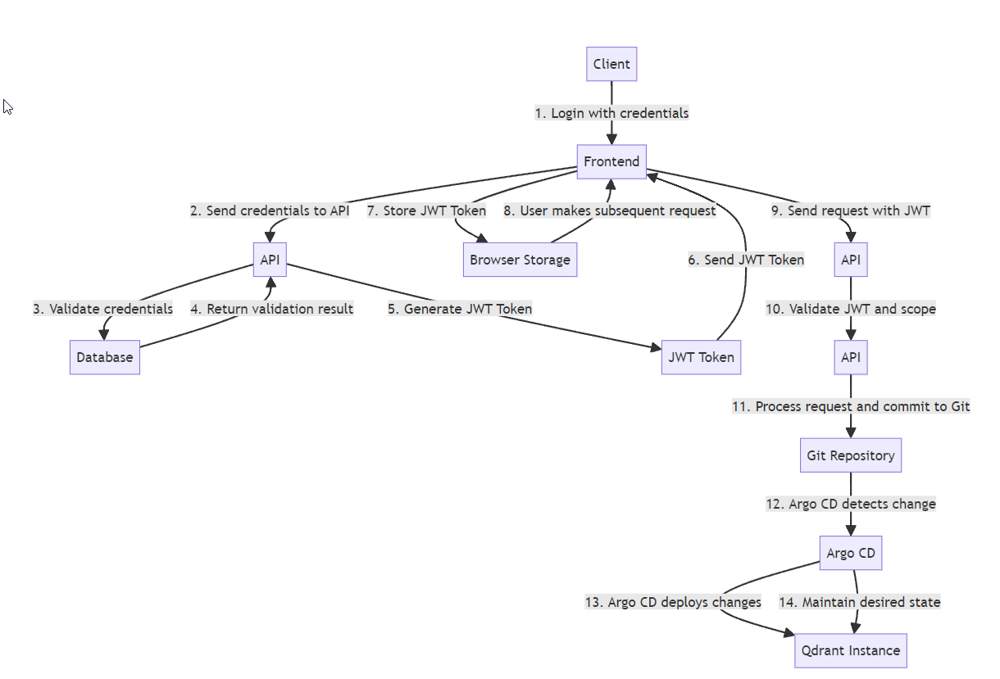
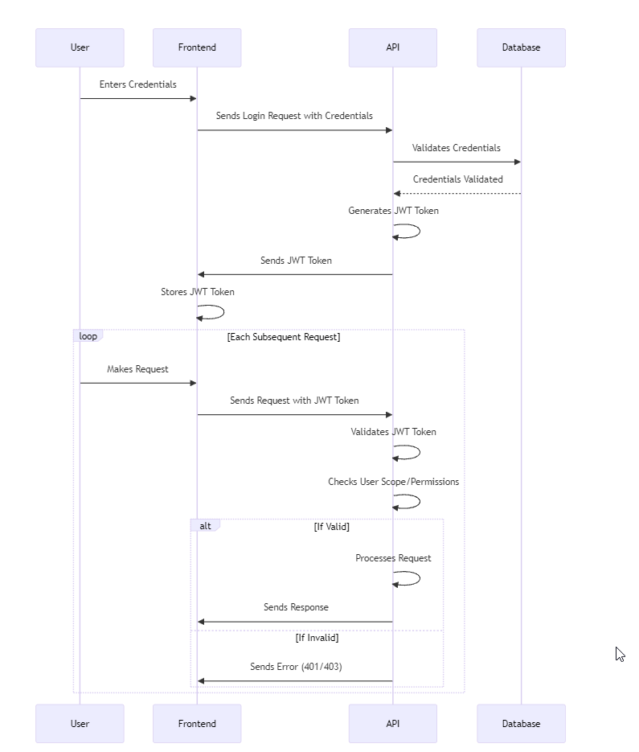
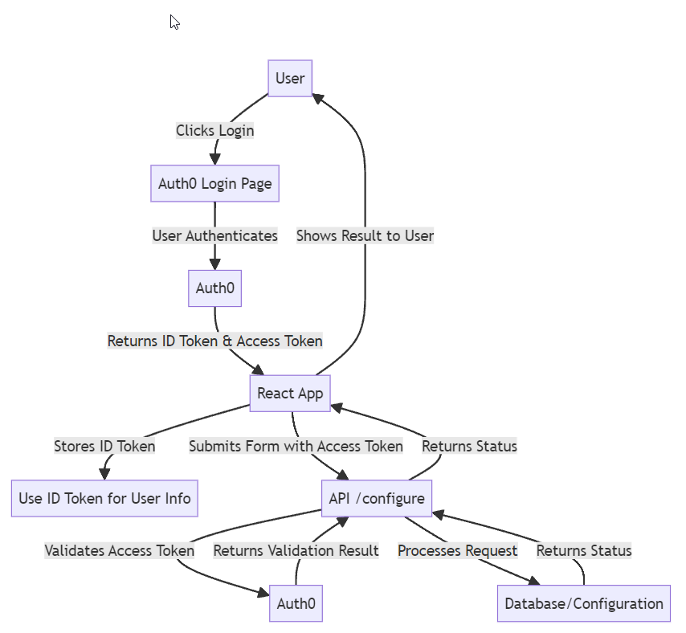

# Qdrant GitOps SaaS DB Management PoC

## Introduction

The objective of this repository is to create a SaaS Database Management Proof of Concept (PoC) for Qdrant databases. This solution is designed to allow multiple clients to manage their Qdrant instances through a well-integrated system comprising a frontend interface, an API, and a GitOps workflow using Argo CD.

Additionally, the solution includes two authentication mechanisms: JWT and OpenID. The frontend is configured to work with both methods, offering flexibility based on different authentication requirements.

## Click to see the full demo of JWT:
 - [JWT DEMO)](https://github.com/morettimaxi/qdrant-gitops/tree/master/source/client-frontend)

### How It Works

This solution employs a three-tier architecture that is meticulously designed to ensure scalability, security, and automation:

- **Frontend**: Provides a user-friendly interface where clients can log in, configure their Qdrant instances, and monitor status updates. The frontend is responsible for interacting with the user and securely transmitting data to the API. The frontend is built using [React](https://reactjs.org/).
  - [Frontend Code (JWT)](https://github.com/morettimaxi/qdrant-gitops/tree/master/source/client-frontend)
  - [Frontend Code (OpenID with Auth0)](https://github.com/morettimaxi/qdrant-gitops/tree/master/source/client-frontend-auth)
  
- **API**: Serves as the intermediary between the frontend and backend systems. It is responsible for validating user credentials, generating and validating JWT tokens, processing client requests, and committing the necessary configuration changes to a Git repository. The API is built using [Node.js](https://nodejs.org/) and [Express](https://expressjs.com/).
  - [API Code](https://github.com/morettimaxi/qdrant-gitops/tree/master/source/api)

- **GitOps (Argo CD)**: Continuously monitors the Git repository for changes and automatically deploys updates to the Qdrant instances. Argo CD ensures that the desired state of the infrastructure, as defined in the Git repository, is maintained consistently across all environments.

- **Link to Argo CD Configuration**: The apps (frontend and API) are configured in Argo CD, which ensures automated deployment and continuous integration.
  - [Argo CD App Configuration](https://github.com/morettimaxi/qdrant-gitops/blob/master/argo-cd/applications/kustomize/argo.yaml)

### JWT Configuration and Flow

The JWT (JSON Web Token) is configured to include specific scopes for each client. Upon client login, the token is validated against the defined scopes, ensuring that each client can only manage their own Qdrant instance. If the token's scope matches the client, the API processes the request, such as configuring replicas, and commits the changes to the GitOps repository. Argo CD then takes over, deploying and maintaining the infrastructure automatically.

- **JWT Validation Code**: The JWT validation is handled in the API.
  - [API JWT validation](https://github.com/morettimaxi/qdrant-gitops/blob/fe4e21ae102843c49531c8c8e2a8403ad50c8dcc/source/api/index.js#L43)

### Flow Explanation

1. **Client Login**: The client logs in through the frontend, where their JWT token is validated.
2. **Scope Validation**: The API checks if the token's scope matches the client's permissions.
3. **Action Processing**: If valid, the client can perform actions like setting the number of replicas through the UI.
4. **GitOps Commit**: The API commits the client's changes to the GitOps repository.
5. **Argo CD Deployment**: Argo CD automatically deploys the changes, ensuring that the client's Qdrant instance is updated.

- **JWT Flow Diagram**:

**Benefits**:
- **Automation**: The entire process is automated, reducing the need for manual intervention.
- **Security**: Scoped JWT tokens ensure that clients can only manage their own resources.
- **Scalability**: The GitOps approach allows for easy scaling of the solution to manage multiple clients.

### Deployment with Kustomize and Argo CD

The deployment strategy leverages Kustomize and Argo CD to manage environment-specific configurations and ensure continuous delivery of the infrastructure.

- **Kustomize**: Manages environment-specific configurations through a layering approach, allowing for base configurations to be overridden by environment-specific settings.
- **Argo CD**: Handles the continuous deployment of the infrastructure by monitoring the Git repository and applying the necessary changes automatically.

- **Override and Kustomize Configuration**: The environment-specific settings and overrides are managed using Kustomize.
  - [Kustomize Overrides](https://github.com/morettimaxi/qdrant-gitops/blob/master/argo-cd/applications/kustomize/overlays/prod/kustomization.yaml)

### Managing Qdrant Helm Charts with Argo CD

Argo CD is also used to manage the Helm charts for each client's Qdrant instance. The Helm charts are configured to deploy client-specific Qdrant instances with environment-specific values.

We use this Helm chart for deploying each Qdrant instance:
- [Qdrant Helm Chart](https://github.com/morettimaxi/qdrant-gitops/tree/master/argo-cd/clients/helm)

Although we are using this Helm chart, it is possible to use a custom resource with the enterprise operator or any Helm configuration, as it works seamlessly with the GitOps approach. Each client has a dedicated `values.yaml` file to configure their specific instance. Here are examples of such configurations:

- [Client 1 Values](https://github.com/morettimaxi/qdrant-gitops/blob/master/argo-cd/clients/helm/client1/values.yaml)
- [Client 2 Values](https://github.com/morettimaxi/qdrant-gitops/blob/master/argo-cd/clients/helm/client2/values.yaml)

These `values.yaml` files contain the necessary configurations for each client, such as resource limits, replica settings, and other deployment-specific parameters.

Argo CD continuously monitors the Git repository for any changes to these `values.yaml` files. Once a change is detected, Argo CD automatically applies the updated configurations, ensuring that the Qdrant instances are always up-to-date with the desired state defined in the Git repository.

For further details, refer to the Argo CD application configuration used to manage these deployments:
- [Argo CD Client Configuration](https://github.com/morettimaxi/qdrant-gitops/blob/master/argo-cd/clients.yaml)

## Auth0 OpenID Connect Integration with React and Node.js API

This README provides an overview of how the Auth0 OpenID Connect (OIDC) integration works within the provided React application and how the Node.js API interacts with it. The setup allows users to log in via Auth0, and the application manages replicas and configurations securely.

## Overview

This solution utilizes Auth0 for user authentication and authorization using the OAuth2 and OpenID Connect protocols. The React application handles the user interface, while the API manages the backend operations.

## How It Works

1. **User Login**:
   - The user initiates the login process by clicking the "Login with Auth0" button.
   - Auth0 handles the authentication through OAuth2/OpenID Connect, returning an ID token and an access token if the login is successful.

2. **ID Token**:
   - The ID token contains user information, such as their nickname or name, which is then used in the React app.

3. **Access Token**:
   - The access token is retrieved from Auth0 and sent to the API for authorization.
   - This access token is required to authenticate API requests, ensuring that only authorized users can interact with the API.

4. **API Interaction**:
   - When the user submits the form, the access token is sent along with the request to the API endpoint (`http://api.local/configure`).
   - The API validates the access token by checking its signature, issuer, audience, and expiry.
   - If the token is valid, the API processes the request (e.g., updating the replicas for the specified client).

5. **OAuth2 and OpenID Connect**:
   - OAuth2 is the underlying protocol that handles the authorization, while OpenID Connect adds an identity layer on top of OAuth2.
   - OpenID Connect provides user authentication and a standard way to obtain user information via the ID token.

## React Application Code

The React application is responsible for handling user interactions, including logging in and configuring replicas. Below is a reference to the code where the Auth0 integration is implemented:

- [React Auth0 Integration Code](https://github.com/morettimaxi/qdrant-gitops/blob/1a8c34b2f4686503dbf049522375c4fca0d0e355/source/client-frontend-auth/src/index.js#L10)

## API Integration

The API validates the access token provided by the React application. Once validated, the API processes the request based on the client's configuration and updates the necessary settings.

## Security

This implementation leverages OAuth2 and OpenID Connect through Auth0 to ensure secure authentication and authorization. The access token allows the API to verify the identity of the requester, ensuring that only authorized users can perform specific actions.

## Diagram

Refer to the diagram (attached separately) that visually represents the interaction between the React application, Auth0, and the API.

### K8s RBAC Permissions and API

The application uses Kubernetes Role-Based Access Control (RBAC) permissions to securely manage access to secrets, particularly for retrieving API keys for Qdrant instances. This setup ensures that only authorized users can retrieve sensitive information such as API keys.

#### How the API Retrieves Secrets

The API includes an endpoint `GET /token/:client` which allows authorized users to retrieve the API key for a specific Qdrant client. Here's a breakdown of how it works:

\`\`\`javascript
app.get('/token/:client', authenticateToken, async (req, res) => {
    const { client } = req.params;

    if (req.user.scope !== client && req.user.scope !== 'admin') {
        return res.status(403).json({ error: 'Insufficient permissions' });
    }

    try {
        const secretName = `qdrant-${client}-apikey`;
        const namespace = `qdrant-${client}`;

        // Fetch the secret from Kubernetes
        const secret = await k8sApi.readNamespacedSecret(secretName, namespace);

        // Check if the api-key field exists in the secret's data
        if (!secret.body.data || !secret.body.data['api-key']) {
            return res.status(500).send({ error: 'API key not found in secret' });
        }

        // Decode the api-key from base64
        const apiKey = Buffer.from(secret.body.data['api-key'], 'base64').toString();

        res.send({ token: apiKey });
    } catch (error) {
        console.error(error);
        res.status(500).send({ error: 'Failed to retrieve token' });
    }
});
\`\`\`

**Explanation**:
- The API first checks if the user has the necessary permissions (i.e., their `scope` matches the `client` or they are an admin).
- The API then fetches the secret from the Kubernetes cluster using the Kubernetes API.
- The secret is retrieved from a specific namespace (`qdrant-{client}`) and is expected to contain the API key.
- The API key is decoded from base64 and returned to the user.

#### Kubernetes RBAC Configuration

The API requires specific permissions to access secrets in Kubernetes. This is achieved through RBAC (Role-Based Access Control) settings:

  - [Rbac config](https://github.com/morettimaxi/qdrant-gitops/blob/master/argo-cd/applications/kustomize/base/rbac.yaml)
  - [API deployment SA](https://github.com/morettimaxi/qdrant-gitops/blob/cecf4937bf7952655166b71b1fee7b711735bc57/argo-cd/applications/kustomize/base/api-deployment.yaml#L17)

**Explanation**:
- **ServiceAccount**: The `api-service-account` is created in the `saas-app` namespace. This service account is used by the API to interact with Kubernetes.
- **ClusterRole**: The `api-read-secrets-cluster-role` defines the permissions that allow the API to read secrets within the cluster.
- **ClusterRoleBinding**: The `api-read-secrets-cluster-role-binding` binds the `ClusterRole` to the `ServiceAccount`, granting it the necessary permissions to read secrets.

#### Frontend Interaction

The frontend application interacts with the API to retrieve the API key. When a user requests to retrieve the API key, the frontend sends an authenticated request to the API, which then retrieves the key from Kubernetes using the permissions granted by the RBAC configuration.

This approach ensures that sensitive operations, like accessing API keys, are performed securely and only by authorized users, leveraging Kubernetes' robust RBAC system.

### Kubernetes Features

The Kubernetes deployments are configured with several advanced features to ensure high availability, resilience, and optimal resource utilization:

- **Liveness Probes and Health Checks**: Ensure that the applications are running correctly and can recover from failures automatically.
- **Resource Limitations**: Set limits on CPU and memory usage to prevent any single application from consuming all available resources.
- **Horizontal Pod Autoscaler (HPA)**: Automatically scales the number of pods based on the current load, ensuring that the application can handle varying levels of traffic.
- **Pod Disruption Budget (PDB)**: Ensures that a minimum number of pods are always available during maintenance or updates.

These features enhance the reliability and efficiency of the deployments, ensuring that the system remains responsive and available under all conditions.
  - [Kubernetes files](https://github.com/morettimaxi/qdrant-gitops/tree/master/argo-cd/applications/kustomize)
  - [Kubernetes Override](https://github.com/morettimaxi/qdrant-gitops/blob/master/argo-cd/applications/kustomize/overlays/prod/kustomization.yaml)

### RBAC and API Security

The API uses Role-Based Access Control (RBAC) to ensure that only authorized clients can access specific resources. RBAC policies are enforced at both the API and Kubernetes levels to ensure security and compliance.

- **RBAC Configuration**:
  - [RBAC Policy](https://github.com/morettimaxi/qdrant-gitops/blob/fe4e21ae102843c49531c8c8e2a8403ad50c8dcc/argo-cd/clients.yaml)

- **API Key and JWT Management**: The API also manages API keys and JWT tokens, ensuring secure authentication and authorization for all client requests.
  - [API Key Management](https://github.com/morettimaxi/qdrant-gitops/blob/fe4e21ae102843c49531c8c8e2a8403ad50c8dcc/source/api/index.js#L59)

### OpenID and Auth0 Integration

The solution also supports OpenID and Auth0 as alternative authentication mechanisms. These integrations provide enhanced security features, such as multi-factor authentication and centralized identity management.

- **OpenID/Auth0 Integration**:
  - [OpenID/Auth0 Configuration](https://github.com/morettimaxi/qdrant-gitops/blob/fe4e21ae102843c49531c8c8e2a8403ad50c8dcc/source/api/auth.js)

### Terraform Deployment

The Terraform scripts in this repository are responsible for setting up the foundational infrastructure, including Argo CD, Kong, and NGINX Ingress. These scripts ensure that the environment is consistently configured and ready for application deployment.

- **Terraform Configuration**:
  - [Terraform Main Configuration](https://github.com/morettimaxi/qdrant-gitops/tree/master/terraform)

### Dockerfile and Features

The Dockerfile is designed to ensure security, efficiency, and scalability. It includes the following features:

- **Multi-Stage Builds**: The Dockerfile uses multi-stage builds to reduce the final image size and ensure that only necessary components are included in the production image.
- **Docker Layer Caching**: This feature speeds up the build process by caching intermediate layers, which is particularly useful during continuous integration and deployment (CI/CD) processes.
- **Security Considerations**: The Dockerfile is configured to minimize the attack surface by including only essential components and applying security best practices.

- **Dockerfile Configuration**:
  - [API Dockerfile](https://github.com/morettimaxi/qdrant-gitops/blob/master/source/api/Dockerfile)
  - [Frontend Dockerfile](https://github.com/morettimaxi/qdrant-gitops/blob/master/source/client-frontend/Dockerfile)

- **Version Management with Argo CD**: Argo CD manages the deployment versions by overriding configurations based on the Docker image tags, ensuring that updates are automatically applied without manual intervention.

### Comparison: OpenID vs. JWT

| Feature             | OpenID                                | JWT                                    |
|---------------------|---------------------------------------|----------------------------------------|
| **Authentication**  | Centralized via Auth0                 | Self-contained                         |
| **Authorization**   | Scopes and roles managed by Auth0     | Scopes included within the token       |
| **Security**        | Higher security with OAuth 2.0 flows  | Secure, but requires careful handling  |
| **Flexibility**     | More flexible with external providers | Simpler, but less flexible             |
| **Integration**     | Easier with existing IdPs             | Requires custom implementation         |
| **Performance**     | Potentially slower due to external calls | Fast, as it's self-contained        |

### Pending Tasks

1. **Terraform Backend**: Create a backend in S3 or another cloud bucket to store the Terraform state.
2. **JWT Signing Key Management**: Use Vault to manage JWT signing keys, implementing automatic key rotation. Ensure that old keys remain visible during rotation to avoid issues.
