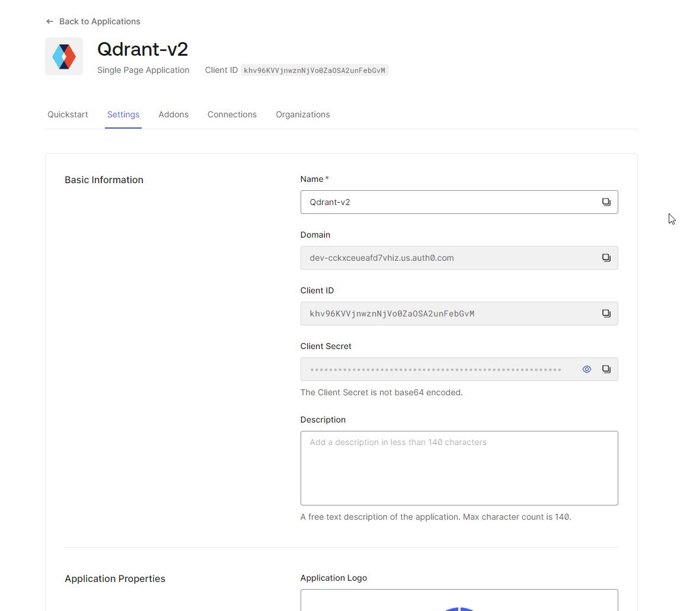

# Using AUTH0 Authentication with the Frontend and API

Follow the steps below to authenticate, configure, and interact with the Qdrant Helm chart using AUTH0 authentication.

### Step 1: Create a Auth0 application using this tutorial

 [https://auth0.com/docs/quickstart/spa/react/interactive](https://auth0.com/docs/quickstart/spa/react/interactive)

### Step 2: Login

Go to [http://frontend.local/](http://frontend.local/)

### Step 3: Login using the created user in auth0

### Step 4: The frontend and API validate the token using https://dev-cckxceueafd7vhiz.us.auth0.com/userinfo endpoint and provide access to client1 or client2 based on the token.

