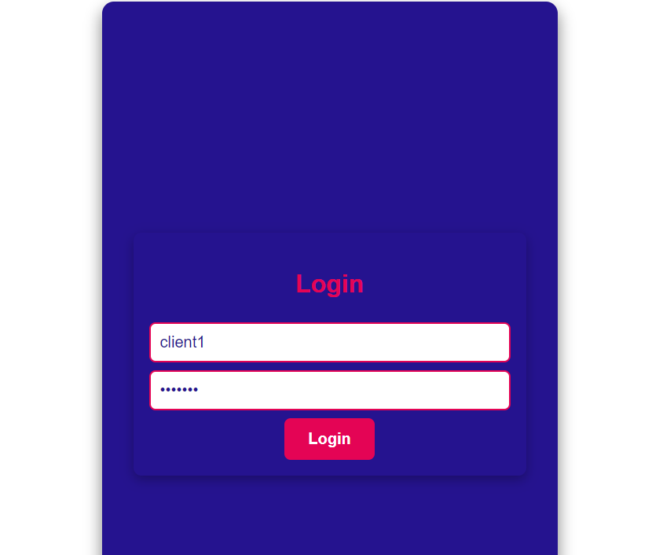
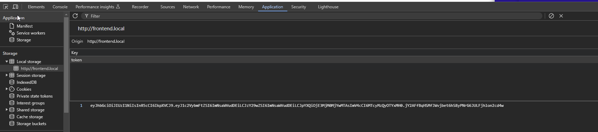
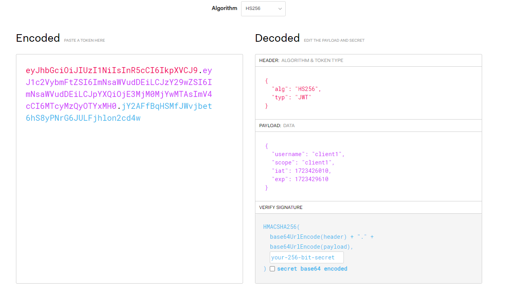
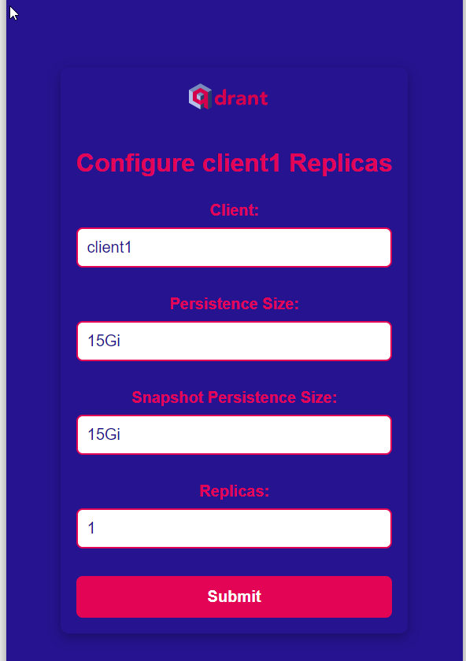
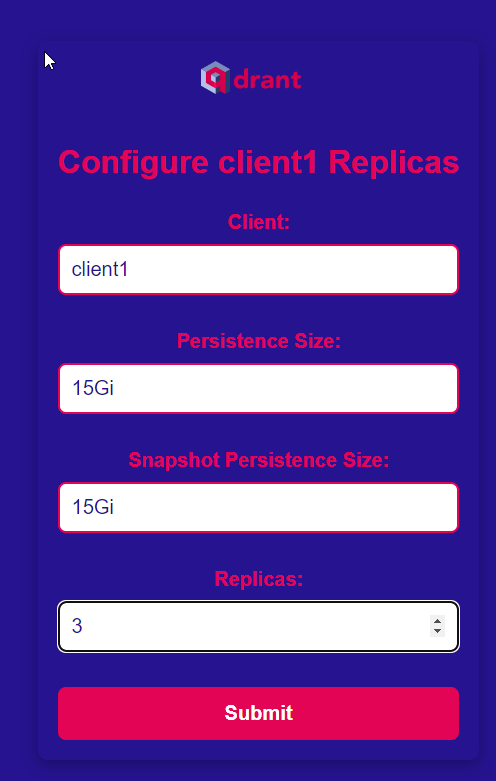
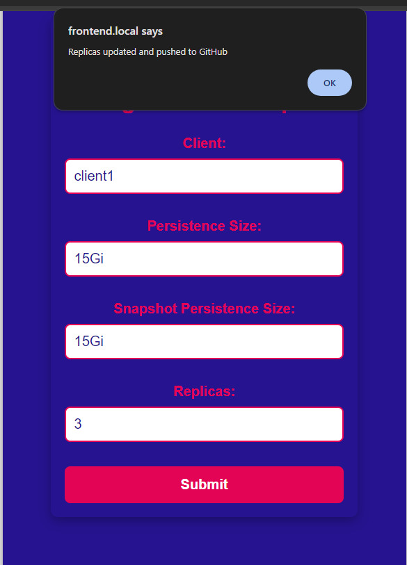
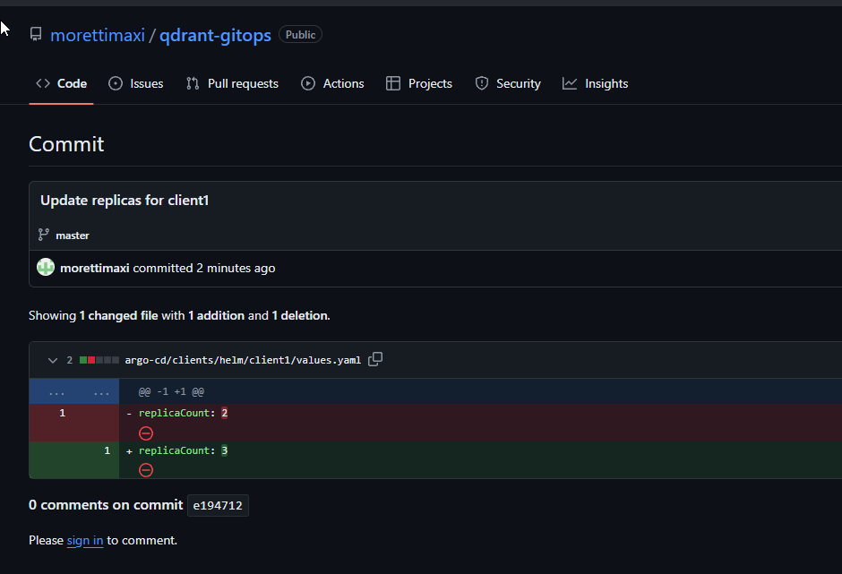
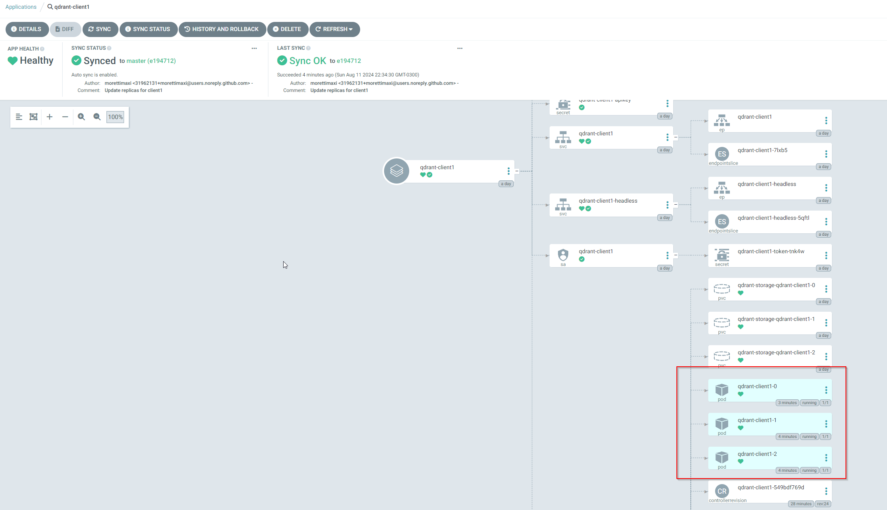
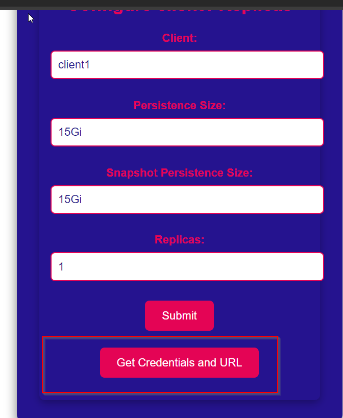
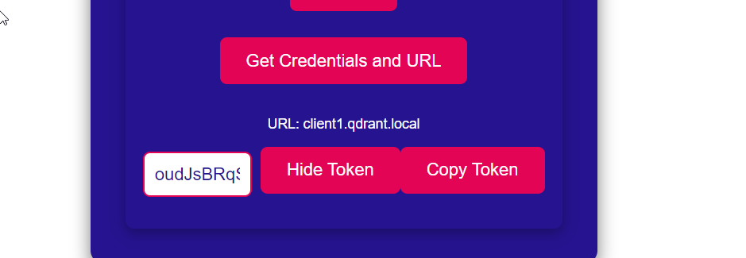

# Using JWT Authentication with the Frontend and API

Follow the steps below to authenticate, configure, and interact with the Qdrant Helm chart using JWT authentication.

### Step 1: Login

Go to [http://frontend.local/](http://frontend.local/)

Login using the following credentials:

- **Username**: client1
- **Password**: client1

Or

- **Username**: client2
- **Password**: client2

### Step 2: API Login Request

The frontend sends a POST request to the following endpoint:

\`\`\`bash
curl 'http://api.local/login'   -H 'Referer: http://frontend.local/'   --data-raw '{"username":"client1","password":"client1"}'   --insecure
\`\`\`

The API will return a JWT token that will be stored in the local storage of the browser.

### Step 3: Decode the JWT Token

If we decode the token, we can see the following information:

The payload contains the scope for the client1 user, so this user can only modify settings for client1.

### Step 4: JWT Token Signature

The token has a verified signature that is encrypted. Only the API can decrypt this token. The signing is handled in the following code:

\`\`\`javascript
const token = jwt.sign({ username, scope: users[username].scope }, SECRET_KEY, { expiresIn: '1h' });
\`\`\`

[View the Code](https://github.com/morettimaxi/qdrant-gitops/blob/463990308973e902cbaeb0000132bbb4a5b46e63/source/api/index.js#L43)

**Note**: The secret key is currently hardcoded. This should be changed to a secret manager like Vault or AWS Secret Manager for storing the secret key. Additionally, a process for rotation should be implemented, and the secret key should be stored in a secure place.

### Step 5: Modify Qdrant Helm Chart

After logging in with the client1 user, you can see the client1 information.

We will modify the number of replicas for the Qdrant Helm chart to 3 replicas.

The frontend makes a POST request to the API, injecting the JWT token in the header:

\`\`\`bash
curl 'http://api.local/configure'   -H 'Authorization: Bearer <JWT_TOKEN>'   --data-raw '{"client":"client1","replicas":"3"}'   --insecure
\`\`\`

### Step 6: API Validation

The API will validate if the user has the scope to modify client1 and if the client exists. It will decode the token using the secret and check the scope and client.

We get a response from the API that the replicas are updated and pushed to GitHub.

The API automatically makes a commit to the Git repository with the new configuration.

[View the Commit](https://github.com/morettimaxi/qdrant-gitops/commit/e19471207607d499adc37b9f827bb35490cfa5bb)

### Step 7: Argo CD Deployment

Argo CD detects the change and applies the new configuration to the cluster.

### Step 8: Retrieve the API Key and Endpoint

The API also has the feature to retrieve the API key and endpoint to connect to the Qdrant API.

\`\`\`bash
curl 'http://api.local/token/client1'   -H 'Authorization: Bearer <JWT_TOKEN>'   --insecure
\`\`\`

The frontend makes this query to the API to get the API key and the endpoint to connect to the Qdrant API and displays the URL and API key to the user.

### Step 9: Insufficient Permissions Example

If we make the same query but with the client2 user, it will return an error because the user does not have the scope to modify client1.

\`\`\`bash
curl 'http://api.local/token/client2'   -H 'Authorization: Bearer <JWT_TOKEN>'   --insecure
\`\`\`

\`\`\`json
{"error":"Insufficient permissions"}
\`\`\`
